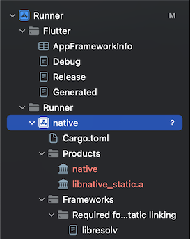
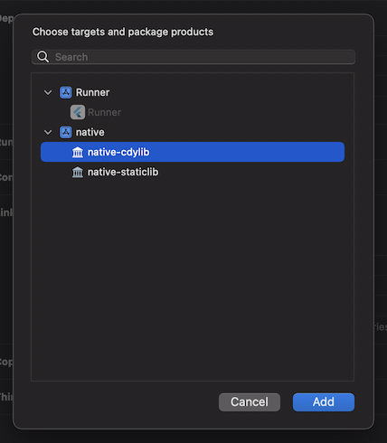

# 链接该项目

在 Xcode 中打开 `ios/Runner.xcodeproj`, 接着把 `$crate/$crate.xcodeproj`
添加为子项目。结果大致是这样：

点击 `Runner` 根项目，接着找到 **Build Phases**. 首先，展开 **Dependencies** , 接着对于 IOS 请添加
**$crate-staticlib** ，对于 MacOS 请添加 **$crate-cdylib** 。

接着，展开 **Link Binary With Libraries**, 为 IOS 添加 **lib$crate_static.a**，或者对于 MacOS
添加 **$crate.dylib**.

