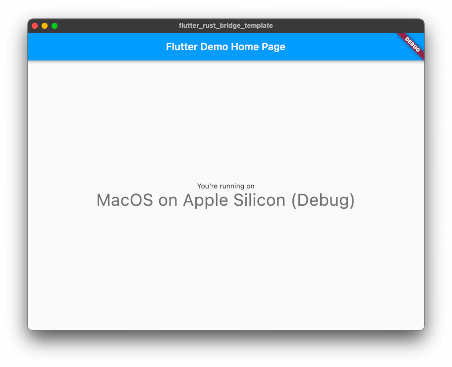

# 收尾

有了对 "平台" 的新定义，我们可以重写以前的代码去使用它！下面是一个例子，展示了 freezed 枚举的使用技巧。

在 `lib/main.dart` 里：

```diff
- final text = const {
-   Platform.Android: 'Android',
-   Platform.Ios: 'iOS',
-   Platform.MacApple: 'MacOS with Apple Silicon',
-   Platform.MacIntel: 'MacOS',
-   Platform.Windows: 'Windows',
-   Platform.Unix: 'Unix',
-   Platform.Wasm: 'the Web',
- }[platform] ??
- 'Unknown OS';
+ final text = platform.when(
+   android: () => 'Android',
+   ios: () => 'iOS',
+   macOs: (arch) => 'MacOS on $arch',
+   windows: () => 'Windows',
+   unix: () => 'Unix',
+   wasm: () => 'the Web',
+ );
```

在 `native/src/api.rs` 里：

```diff
     } else if cfg!(target_os = "ios") {
         Platform::Ios
     } else if cfg!(all(target_os = "macos", target_arch = "aarch64")) {
-        Platform::MacApple
+        Platform::MacOs("Apple Silicon".into())
     } else if cfg!(target_os = "macos") {
-        Platform::MacIntel
+        Platform::MacOs("Intel".into())
     } else if cfg!(target_family = "wasm") {
         Platform::Wasm
     } else if cfg!(unix) {
```

当你运行 `flutter run` 后，你应该能看到： 
