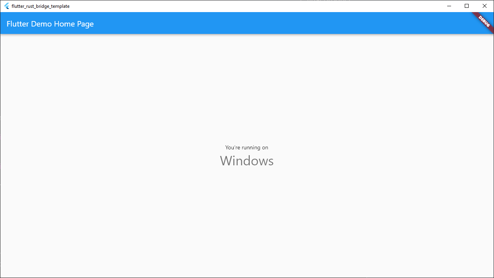

# 模板之旅

祝贺！🎉 现在你应该有一个可以正常运行的 Flutter 应用了，并且配备了 一个 Rust 运行时组件。本节旨在温和地介绍 Rust 与现有 Flutter
工具链集成的细节。不用担心，你可以直接跳到[生成代码](generate.md)一节来学习如何编写新的代码。或者直接查看
[集成到现有项目](../integrate.md) 一节，将 Rust 添加到现有的 Flutter 项目
